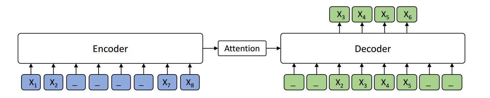

# MASS

[MASS](https://arxiv.org/pdf/1905.02450.pdf) is a novel pre-training method for sequence to sequence based language generation tasks.
 It randomly masks a sentence fragment in the encoder, and then predicts it in the decoder.



MASS can be applied on cross-lingual tasks such as neural machine translation (NMT), 
and monolingual tasks such as text summarization. 
The current codebase supports unsupervised NMT (implemented based on XLM).

Credits: the original developers/researchers:
```
facebookresearch/XLM
   |---microsoft/MASS
        |---<this>
```

## Unsupervised NMT

Unsupervised Neural Machine Translation just uses monolingual data to train the models. During MASS pre-training, the source and target languages are pre-trained in one model, with the corresponding langauge embeddings to differentiate the langauges. During MASS fine-tuning, back-translation is used to train the unsupervised models. Code is under [MASS-unsupNMT](MASS-unsupNMT). We provide pre-trained and fine-tuned models:

| Languages | Pre-trained Model | Fine-tuned Model | BPE codes | Vocabulary |
|-----------|:-----------------:|:----------------:| ---------:| ----------:|
| EN - FR   | [MODEL](https://modelrelease.blob.core.windows.net/mass/mass_enfr_1024.pth)    |   [MODEL](https://modelrelease.blob.core.windows.net/mass/mass_ft_enfr_1024.pth)   | [BPE codes](https://dl.fbaipublicfiles.com/XLM/codes_enfr) | [Vocabulary](https://dl.fbaipublicfiles.com/XLM/vocab_enfr) |
| EN - DE   | [MODEL](https://modelrelease.blob.core.windows.net/mass/mass_ende_1024.pth) | [MODEL](https://modelrelease.blob.core.windows.net/mass/mass_ft_ende_1024.pth) | [BPE codes](https://dl.fbaipublicfiles.com/XLM/codes_ende) | [Vocabulary](https://dl.fbaipublicfiles.com/XLM/vocab_ende) |
| En - RO   | [MODEL](https://modelrelease.blob.core.windows.net/mass/mass_enro_1024.pth) | [MODEL](https://modelrelease.blob.core.windows.net/mass/mass_ft_enro_1024.pth) | [BPE_codes](https://dl.fbaipublicfiles.com/XLM/codes_enro) | [Vocabulary](https://dl.fbaipublicfiles.com/XLM/vocab_enro) |

We are also preparing larger models on more language pairs, and will release them in the future.

### Dependencies
Currently we implement MASS for unsupervised NMT based on the codebase of [XLM](https://github.com/facebookresearch/XLM). The depencies are as follows:
- Python 3
- NumPy
- PyTorch (version 0.4 and 1.0)
- fastBPE (for BPE codes)
- Moses (for tokenization)
- Apex (for fp16 training)

### Data Ready

We use the same BPE codes and vocabulary with XLM. Here we take English-French as an example.

```
cd MASS

wget https://dl.fbaipublicfiles.com/XLM/codes_enfr
wget https://dl.fbaipublicfiles.com/XLM/vocab_enfr

./get-data-nmt.sh --src en --tgt fr --reload_codes codes_enfr --reload_vocab vocab_enfr
```

### Pre-training:
```
python train.py                                      \
--exp_name unsupMT_enfr                              \
--data_path ./data/processed/en-fr/                  \
--lgs 'en-fr'                                        \
--mass_steps 'en,fr'                                 \
--encoder_only false                                 \
--emb_dim 1024                                       \
--n_layers 6                                         \
--n_heads 8                                          \
--dropout 0.1                                        \
--attention_dropout 0.1                              \
--gelu_activation true                               \
--tokens_per_batch 3000                              \
--optimizer adam_inverse_sqrt,beta1=0.9,beta2=0.98,lr=0.0001 \
--epoch_size 200000                                  \
--max_epoch 100                                      \
--eval_bleu true                                     \
--word_mass 0.5                                      \
--min_len 5                                          \
```


During the pre-training prcess, even without any back-translation, you can observe the model can achieve some intial BLEU scores:
```
epoch -> 4
valid_fr-en_mt_bleu -> 10.55
valid_en-fr_mt_bleu ->  7.81
test_fr-en_mt_bleu  -> 11.72
test_en-fr_mt_bleu  ->  8.80
```
#### Distributed Training

To use *multiple GPUs* e.g. 3 GPUs **on same node**
```
export NGPU=3; CUDA_VISIBLE_DEVICES=0,1,2 python -m torch.distributed.launch --nproc_per_node=$NGPU train.py [...args]
```
To use *multiple GPUS* across **many nodes**, use Slurm to request multi-node job and launch the above command. 
The code automatically detects the SLURM_* environment vars to distribute the training.


### Fine-tuning 
After pre-training, we use back-translation to fine-tune the pre-trained model on unsupervised machine translation:
```
MODEL=mass_enfr_1024.pth

python train.py \
  --exp_name unsupMT_enfr                              \
  --data_path ./data/processed/en-fr/                  \
  --lgs 'en-fr'                                        \
  --bt_steps 'en-fr-en,fr-en-fr'                       \
  --encoder_only false                                 \
  --emb_dim 1024                                       \
  --n_layers 6                                         \
  --n_heads 8                                          \
  --dropout 0.1                                        \
  --attention_dropout 0.1                              \
  --gelu_activation true                               \
  --tokens_per_batch 2000                              \
  --batch_size 32	                                     \
  --bptt 256                                           \
  --optimizer adam_inverse_sqrt,beta1=0.9,beta2=0.98,lr=0.0001 \
  --epoch_size 200000                                  \
  --max_epoch 30                                       \
  --eval_bleu true                                     \
  --reload_model "$MODEL,$MODEL"                       \
```

We also provide a demo to use MASS pre-trained model on the WMT16 en-ro bilingual dataset. We provide pre-trained and fine-tuned models:

| Model | Ro-En BLEU (with BT) |
|:---------:|:----:|
| Baseline | 34.0 |
| XLM | 38.5 |
| [MASS](https://modelrelease.blob.core.windows.net/mass/mass_mt_enro_1024.pth) | 39.1 |


Download dataset by the below command:
```
wget https://dl.fbaipublicfiles.com/XLM/codes_enro
wget https://dl.fbaipublicfiles.com/XLM/vocab_enro

./get-data-bilingual-enro-nmt.sh --src en --tgt ro --reload_codes codes_enro --reload_vocab vocab_enro
```

After download the mass pre-trained model from the above link. And use the following command to fine tune:
```
MODEL=mass_enro_1024.pth

python train.py \
	--exp_name unsupMT_enro                              \
	--data_path ./data/processed/en-ro                   \
	--lgs 'en-ro'                                        \
	--bt_steps 'en-ro-en,ro-en-ro'                       \
	--encoder_only false                                 \
	--mt_steps 'en-ro,ro-en'                             \
	--emb_dim 1024                                       \
	--n_layers 6                                         \
	--n_heads 8                                          \
	--dropout 0.1                                        \
	--attention_dropout 0.1                              \
	--gelu_activation true                               \
	--tokens_per_batch 2000                              \
	--batch_size 32                                      \
	--bptt 256                                           \
	--optimizer adam_inverse_sqrt,beta1=0.9,beta2=0.98,lr=0.0001 \
	--epoch_size 200000                                  \
	--max_epoch 50                                       \
	--eval_bleu true                                     \
	--reload_model "$MODEL,$MODEL"
```


## Training Details 

`MASS-base-uncased` uses 32x NVIDIA 32GB V100 GPUs and trains on (Wikipekia + BookCorpus, 16GB) for 20 epochs (float32), batch size is simulated as 4096.

### Other questions
> 1. Q: When I run this program in multi-gpus or multi-nodes, the program reports errors like `ModuleNotFouldError: No module named 'mass'`.   
  A: This seems a bug in python `multiprocessing/spawn.py`, a direct solution is to move these files into each relative folder under fairseq. Do not forget to modify the import path in the code.


## Reference

If you find MASS useful in your work, you can cite the paper as below:

    @inproceedings{song2019mass,
        title={MASS: Masked Sequence to Sequence Pre-training for Language Generation},
        author={Song, Kaitao and Tan, Xu and Qin, Tao and Lu, Jianfeng and Liu, Tie-Yan},
        booktitle={International Conference on Machine Learning},
        pages={5926--5936},
        year={2019}
    }
    
## Related Works

* [MPNet: Masked and Permuted Pre-training for Language Understanding](https://arxiv.org/pdf/2004.09297.pdf), by Kaitao Song, Xu Tan, Tao Qin, Jianfeng Lu, Tie-Yan Liu. GitHub: https://github.com/microsoft/MPNet

