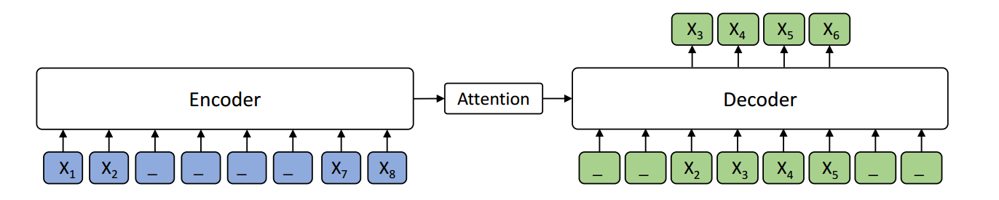

= UnMass v0.2

Code: https://github.com/thammegowda/unmass

https://arxiv.org/pdf/1905.02450.pdf[MASS] is a novel pre-training method for sequence to sequence based language generation tasks.
 It randomly masks a sentence fragment in the encoder, and then predicts it in the decoder.

MASS can be applied on cross-lingual tasks such as neural machine translation (NMT),
and monolingual tasks such as text summarization.
The current codebase supports unsupervised NMT (implemented based on XLM).

Credits: the original developers/researchers:

    facebookresearch/XLM
       |---microsoft/MASS
            |---<this> thammegowda/unmass

== Older Versions
* link:v0.1.html[v0.1]

== Unsupervised MASS (UnMASS)

Unsupervised Neural Machine Translation just uses monolingual data to train the models.
 During MASS pre-training, the source and target languages are pre-trained in one model, with the
 corresponding language embeddings to differentiate the languages.
  During MASS fine-tuning, back-translation is used to train the unsupervised models.
  We provide pre-trained and fine-tuned models:

.Table
|===
| Languages | Pre-trained Model | Fine-tuned Model | BPE codes | Vocabulary

| EN - FR   | https://modelrelease.blob.core.windows.net/mass/mass_enfr_1024.pth[MODEL]    |   https://modelrelease.blob.core.windows.net/mass/mass_ft_enfr_1024.pth[MODEL] | https://dl.fbaipublicfiles.com/XLM/codes_enfr[BPE_codes] | https://dl.fbaipublicfiles.com/XLM/vocab_enfr[Vocabulary]
| EN - DE   | https://modelrelease.blob.core.windows.net/mass/mass_ende_1024.pth[MODEL] | https://modelrelease.blob.core.windows.net/mass/mass_ft_ende_1024.pth[MODEL] | https://dl.fbaipublicfiles.com/XLM/codes_ende[BPE_codes] | https://dl.fbaipublicfiles.com/XLM/vocab_ende[Vocabulary]
| En - RO   | https://modelrelease.blob.core.windows.net/mass/mass_enro_1024.pth[MODEL] | https://modelrelease.blob.core.windows.net/mass/mass_ft_enro_1024.pth[MODEL] | https://dl.fbaipublicfiles.com/XLM/codes_enro[BPE_codes] | https://dl.fbaipublicfiles.com/XLM/vocab_enro[Vocabulary]
|===

== Setup

----

# create a conda env
conda create -n unmass python=3.7 && conda activate unmass

# for development, install it from git repo
git clone git@github.com:thammegowda/unmass.git  && cd unmass
pip install --editable .

# install it from pypi https://pypi.org/project/unmass/
pip install unmass
----

== Data Ready

*Preparing from scratch:*
----
MONO=/path/to/monolingual
PARA_VAL=/path/to/parallel/validation

unmass-prep --src de --tgt en --data runs/001-ende \
  --mono $MONO --para_val $PARA_VAL

# this looks for $MONO.{src,tgt} and $PARA_VAL.{src,tgt}
----

== Pre-training:

[source, bash]
----
python -m unmass.train --exp_path unmass-./runs/001-ende/pretrain  \
--data_path ./runs/001-ende/prepared                  \
--lgs 'en-fr'                                        \
--mass_steps 'en,fr'                                 \
--encoder_only false                                 \
--emb_dim 1024                                       \
--n_layers 6                                         \
--n_heads 8                                          \
--dropout 0.1                                        \
--attention_dropout 0.1                              \
--gelu_activation true                               \
--tokens_per_batch 3000                              \
--optimizer adam_inverse_sqrt,beta1=0.9,beta2=0.98,lr=0.0001 \
--epoch_size 200000                                  \
--max_epoch 100                                      \
--eval_bleu true                                     \
--word_mass 0.5                                      \
--min_len 5                                          \
----

During the pre-training prcess, even without any back-translation, you can observe the model can achieve some initial BLEU scores:
----
epoch -> 4
valid_fr-en_mt_bleu -> 10.55
valid_en-fr_mt_bleu ->  7.81
test_fr-en_mt_bleu  -> 11.72
test_en-fr_mt_bleu  ->  8.80
----

=== Fine-tuning
After pre-training, we use back-translation to fine-tune the pre-trained model on unsupervised machine translation:

[source,bash]
----
MODEL=/runs/001-ende/pretrain/checkpoint.pth

python -m unmass.train --exp_path ./runs/001-ende/finetune \
  --data_path ./runs/001-ende/prepared                  \
  --lgs 'en-fr'                                        \
  --bt_steps 'en-fr-en,fr-en-fr'                       \
  --encoder_only false                                 \
  --emb_dim 1024                                       \
  --n_layers 6                                         \
  --n_heads 8                                          \
  --dropout 0.1                                        \
  --attention_dropout 0.1                              \
  --gelu_activation true                               \
  --tokens_per_batch 2000                              \
  --batch_size 32	                                     \
  --bptt 256                                           \
  --optimizer adam_inverse_sqrt,beta1=0.9,beta2=0.98,lr=0.0001 \
  --epoch_size 200000                                  \
  --max_epoch 30                                       \
  --eval_bleu true                                     \
  --reload_model "$MODEL,$MODEL"                       \
----

== Reference

If you find MASS useful in your work, you can cite the paper as below:

    @inproceedings{song2019mass,
        title={MASS: Masked Sequence to Sequence Pre-training for Language Generation},
        author={Song, Kaitao and Tan, Xu and Qin, Tao and Lu, Jianfeng and Liu, Tie-Yan},
        booktitle={International Conference on Machine Learning},
        pages={5926--5936},
        year={2019}
    }

